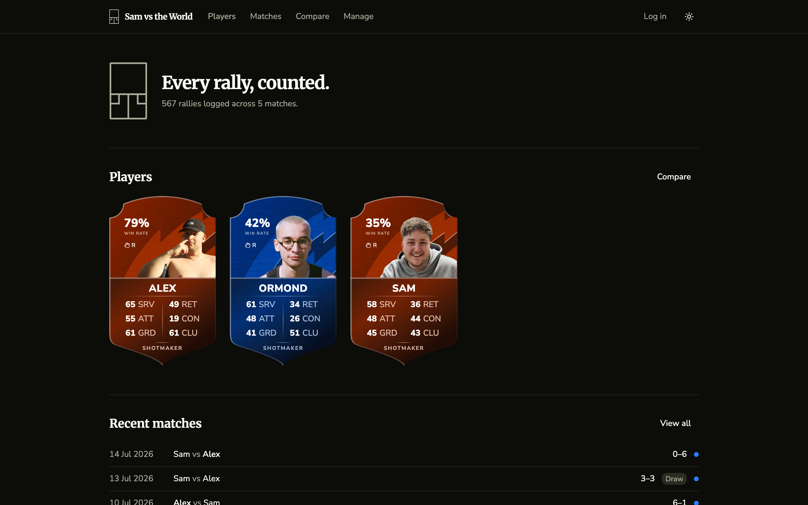
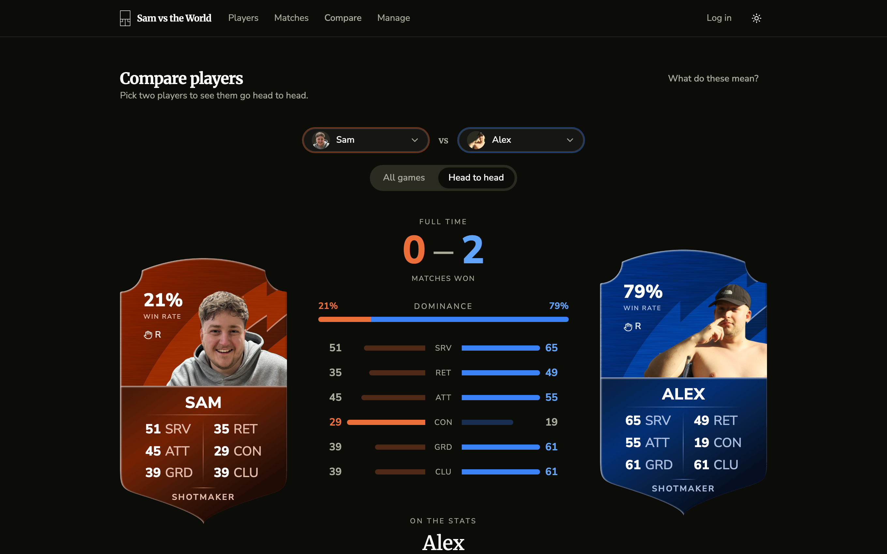
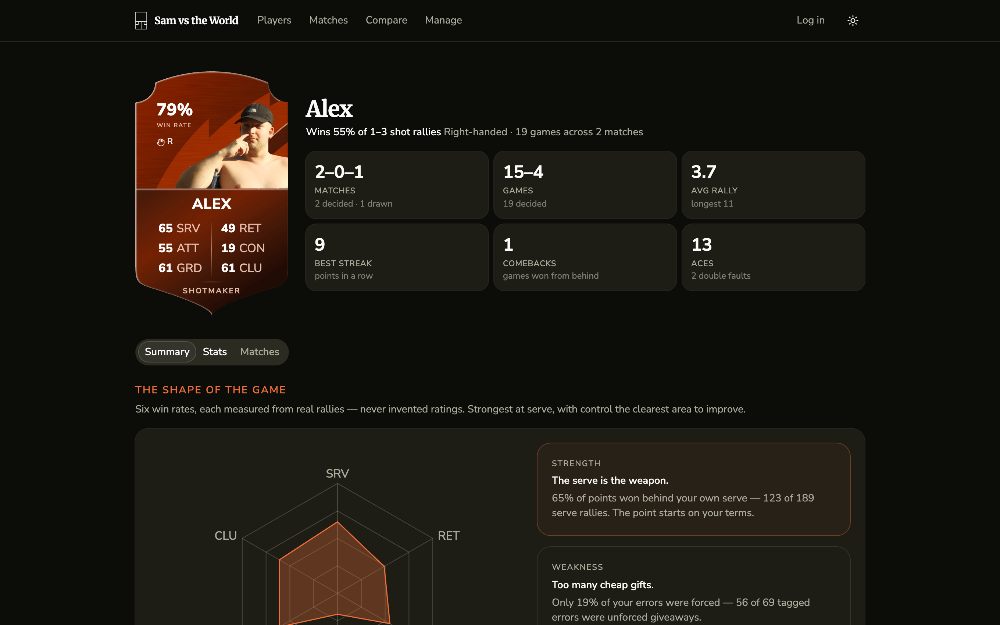
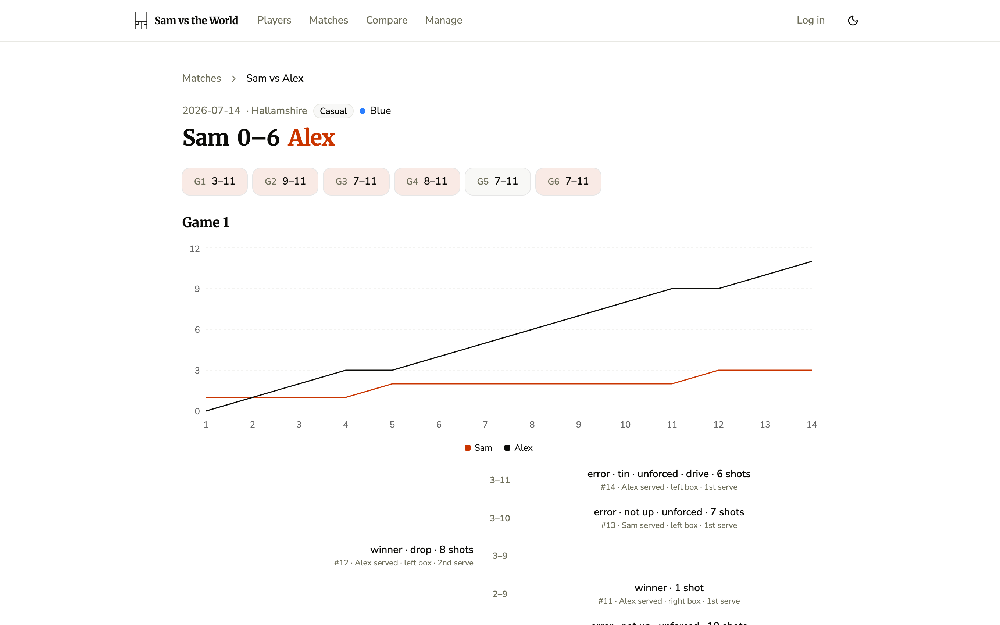

# Sam vs the World

A personal squash analytics app. Matches are recorded on video, reviewed afterwards, and logged
**rally-by-rally** — one row per point, capturing how every rally ended (winner, tin, stroke, ace,
serve fault…), serve side and number, and rally length. The footage itself is never stored; the
ordered rally sequence is the single source of truth, and everything else — running scores, game and
match winners, head-to-head records, serve stats, comebacks, streaks — is derived from it.

**Live demo:** https://sam-vs-the-world.samhepburn98.workers.dev

## Screenshots

The roster — every player is a card, with six attribute ratings derived from their real rallies:



Compare — two players go head to head, cards on the outer edges and the comparison engine down the
centre:



Player profiles and match pages (the app ships light and dark themes):

|                       Player profile                        |                            Match detail                             |
| :---------------------------------------------------------: | :-----------------------------------------------------------------: |
|  |  |

## Highlights

- **Rallies are the only facts.** The database stores the ordered rally sequence and nothing else.
  Scores, game and match winners, head-to-head records, streaks, and comebacks are all derived from
  it in Postgres — recomputable at any time, impossible to drift out of sync
  ([the database explained](docs/database.md)).
- **RPC-per-insight.** Every dashboard insight is a dedicated SQL function behind a typed client
  wrapper; RLS makes the whole dataset public-read while writes stay owner-only.
- **House rules as data.** Scoring variants — serves per point, win-by-two, sudden death — live in
  the schema, and [fixture-driven tests](fixtures/) prove the derivation under each ruleset,
  including the awkward ones (abandoned best-of-5s, ties, lets mid-game).
- **Enforced architecture.** A feature-based tree whose `shared → features → routes` layering is
  enforced by lint rules, not convention ([the architecture](docs/architecture.md)).
- **A golden-path e2e.** One Playwright test drives the real pipeline — log in, create players,
  hotkey rally entry, finish the match — against a local Supabase stack, then asserts the raw rows,
  the derived views, and the re-rendered scores.
- **A written trail.** The [70k-word spec](PROJECT_PLAN.md) came first; a
  [decision log](docs/decisions.md) and a [codebase audit](docs/codebase-audit-2026-07-14.md) came
  after. Work runs as one issue = one PR.

## Stack

- [TanStack Start](https://tanstack.com/start) (React 19 + TypeScript) — SSR'd public dashboard,
  client-heavy private logger
- [Supabase](https://supabase.com) (Postgres) — schema-enforced rally data, derived views,
  RPC-per-insight, RLS (public read / owner-only write)
- [shadcn/ui](https://ui.shadcn.com) + Tailwind 4 — themed from a single preset
- Recharts, TanStack Query, Vitest + Playwright, Cloudflare Workers

## Project brief & docs

The full specification — data model, insight definitions, page specs, architecture, test strategy,
and roadmap — lives in [PROJECT_PLAN.md](PROJECT_PLAN.md). Work is organised as
[issues](../../issues) grouped by phase milestones; one issue = one PR.

Standalone reference docs live in [docs/](docs/): [the architecture](docs/architecture.md) (how the
code is organised and the enforced module boundaries), [the database explained](docs/database.md),
and [the decision log](docs/decisions.md).

## Development

```bash
pnpm install
pnpm dev           # http://localhost:3000
pnpm typecheck
pnpm test          # unit/component (vitest)
pnpm test:e2e      # playwright (boots its own server on 3210)
pnpm build
pnpm run deploy    # build + wrangler deploy ("run" required — bare `pnpm deploy` is a reserved pnpm command)
```

### Golden path (full pipeline e2e)

The golden path logs a real match through the UI — login, players, setup,
hotkey rally entry, finish — and asserts the DB rows, the derived views, and
the re-rendered score. It runs **only against the local Supabase stack**
(never the cloud project) and needs Docker running:

```bash
supabase start     # local stack on 54321; applies all migrations
pnpm test:golden   # boots its own app server on 3211
```

## Deployment

Deployed on Cloudflare Workers: https://sam-vs-the-world.samhepburn98.workers.dev
